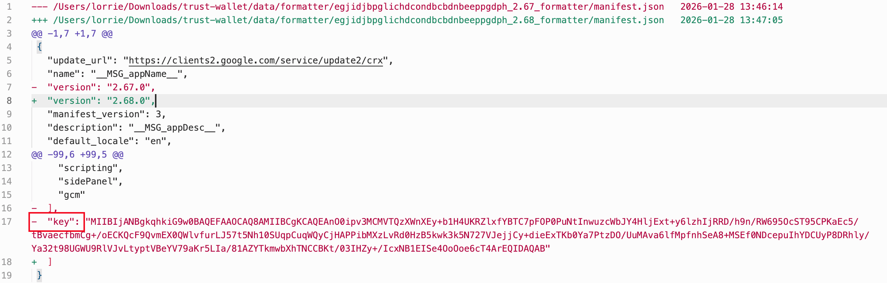

# Trust Wallet 漏洞定位分析（Browser Extension v2.68）

## 1. 概述

2025 年 12 月 26 日，@zachxbt 首先披露“一些 Trust Wallet 用户报告，在过去几个小时内，他们的钱包地址中的资金被盗走”。随后，Trust Wallet 官方确认其**浏览器扩展版本 2.68**存在安全风险。此次事件并非由用户误操作或常规网络钓鱼导致，而是由官方发布的有缺陷版本引入，属于供应链攻击范畴。

本文将基于Trust Wallet 2.68与上一个安全版本2.67的对比，演示如何逐步定位恶意代码、分析数据泄露路径，旨在为处置类似供应链攻击提供一套可复用的分析方法与实践经验。

## 2. 问题确认
当安全事件发生时，我们首先需要确定分析起点。对于 Trust Wallet 2.68 事件，我们手头有两个关键信息：
1. 用户资金被盗，官方确认v2.68版本有问题。
2. 有问题的版本是2.68，需要对比的安全版本是2.67

资金被盗直接指向两个最根本的可能性：**私钥/助记词泄露**与**恶意签名诱导**。两者的共同点是：恶意版本必须具备“对外输出通道”（网络请求、埋点上报、日志上传等），或能干预敏感流程（解锁、导出、签名等）。因此，定位工作的关键在于识别版本 2.68 相比一个已知的安全版本（如2.67）**新增的外部交互点**以及其在敏感流程中的触发条件。基于这一定位目标，
下一节将给出本文采用的分析方法与总体流程。

## 3. 方法总览
直接对比两个版本的混淆代码会面临以下两个关键性挑战：
1. 直接对两个扩展包的混淆产物做全量 diff 会产生大量噪音：压缩格式差异、变量名混淆、模块重排等都可能淹没真实后门逻辑；
2. 扩展内部调用链长且事件/异步较多，仅靠静态差异很难证明“何时触发、触发后做了什么”。

因此，本文采用分层分析策略，先从低混淆配置文件入手缩小范围，再对代码进行反混淆与降噪 diff 提取关键新增逻辑，同时结合流量对比与运行时调试完成验证。

## 4. 静态分析

### 4.1 结构化元数据比对（先看最少噪音的文件）

在深入代码前，优先比对不混淆或低混淆的结构化配置文件，通常可以快速缩小范围：

- **`manifest.json`**：本次事件中，可疑版本删除了 `"key"` 字段。Chrome 扩展的 `key` 用于固定扩展 ID（通常由 Chrome Web Store 管理）。移除该字段暗示该包体可能并非按常规官方渠道发布，需进一步结合发布链路取证。

- **依赖库对比**：如 `package.json`、`package-lock.json`、`yarn.lock`。本次攻击未体现为依赖层面的显著变化，但在类似事件中该项通常高风险、不可跳过。

### 4.2 反混淆与降噪 diff

由于代码高度混淆，直接文本 diff 噪音极大，采用如下工作流降噪：

1. **反混淆与格式化**：对混淆代码做初步反混淆与格式化，消除仅由压缩/换行引入的差异
2. **递归差异化比对**：对处理后的两个版本递归 diff
3. **降噪算法**：将代码行归一化（标识符替换为 X，保留函数参数列表），计算删除行与添加行相似度；若归一化后完全相同或相似度 ≥ 70%，判定为噪音并删除该 hunk

### 4.3 结合大模型初筛

在获得降噪 diff 后，采用优先级策略结合大模型做初筛，以更快缩小人工分析范围：

- **优先级 1：新增文件**  
  对每个新增文件优先寻找“可能与外界交互的发送点”（网络、埋点、日志上报等），模型定位后再人工复核。
- **优先级 2：新增代码块（hunk）**  
  在已知可疑文件中，对新增 hunk 进行同样分析。

    

需要强调的是：模型命中高度依赖语义（如函数名/变量名）。当恶意代码将窃取助记词的关键操作命名为 `GET_SEED_PHRASE` 时很容易被命中；若改为无意义混淆名，其识别能力会显著下降。因此模型适合做“筛选器”，结论仍需动态证据闭环。

## 5. 动态分析

### 5.1 流量差异对比（同操作序列）

恶意逻辑常通过新增外部通信实现数据导出，因此流量分析应以“**两个版本在同一操作序列下的请求差异**”为核心，而不是依赖一次抓包偶然发现。

做法是：在安全版本（2.67）与漏洞版本（2.68）执行一致的用户操作（如解锁、导入等），分别记录扩展产生的外发请求，并对请求集合做差异对比，重点关注：

- **域名**（新增目的地）
- **接口路径**
- **请求体字段结构**（是否出现异常字段或字段值异常）

本次对比发现：在特定用户操作（如**解锁钱包**）时，扩展会向新增域名 **`api.metrics-trustwallet.com`** 发起请求，且请求体中异常插入本不应出现的 `errorMessage` 字段。

同时尝试多种场景后观察到：只有在“登录/解锁钱包”的时候才抓到该 `errorMessage`，并且位于 `event: "Unlock"` 事件里。

### 5.2 运行时调试（绑定触发条件与调用栈）

对静态分析定位到的可疑点设置断点。通过模拟用户输入密码解锁钱包，在调试器中捕获执行流，并追踪到关键可疑调用（示例：**`yield G.YW.emit()`**）。

## 6. 总结
通过分析，确定了以下几个关键点：
- **新增外联域名**：`api.metrics-trustwallet.com`
- **强相关触发点**：解锁流程（`event: "Unlock"`）
- **异常载荷线索**：请求体新增/异常字段 `errorMessage`
- **可疑执行点**：解锁流程中命中 `yield G.YW.emit()`
Trust Wallet v2.68版本在解锁钱包时，会向一个可疑域名发送包含异常字段 (助记词) 的请求。这种行为具有明显的数据外传特征，很可能就是导致用户资金被盗的原因。